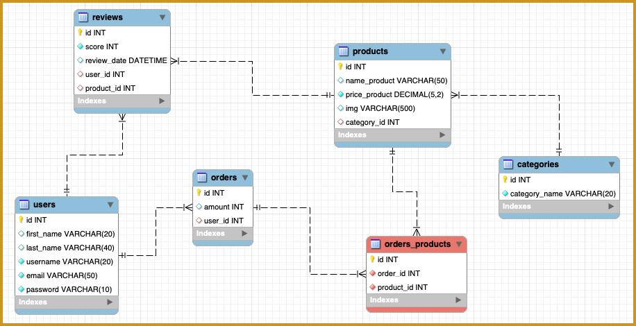

# Ecommerce API 📺
An ecommerce API where you can create, update, delete, and search products, categories, and orders, as well as register and authenticate users. Users can also be assigned roles and permissions, and reviews can be added to products.

## Diagram 📈


## Requirements 📋
### Products 📦
* Endpoint to create a product
```
localhost:3000/products/create
```
* Endpoint to update a product
```
localhost:3000/products/updateById/id
```
* Endpoint to delete a product
```
localhost:3000/products/deleteById/id
```
* The endpoint to fetch products should also display the category or categories it belongs to.
```
localhost:3000/products/getAllProducts
```

* Endpoint to fetch a product by id
```
localhost:3000/products/getById/id
```
* Filter to search for a product by name
```
localhost:3000/products/getByName/name
```
* Filter to search for a product by price
```
localhost:3000/products/getByPrice/price
```
* Filter to order products from highest to lowest price
```
localhost:3000/products/orderDesc
```

* Implement validation when creating a product to ensure that all fields are filled in, and return a message if not.

* You can only create, update, and delete products if you are authenticated.

---

### Categories 🏷
* CRUD categories
```
localhost:3000/categories/create
localhost:3000/categories/getAll
localhost:3000/categories/updateById/id
localhost:3000/categories/deleteById/id
```
* Endpoint to view all categories along with their products
```
localhost:3000/categories/getAllCategories
```
* Endpoint to fetch a category by id
```
localhost:3000/categories/getById/id
```
* Filter to search for a category by name
```
localhost:3000/categories/getByName/name
```

---

### Orders 🗳
* Endpoint to view orders along with their products
```
localhost:3000/orders/getOrderProduct
```
* Endpoint to create orders
```
localhost:3000/orders/create/
```

---


### Users 👤
* Endpoint to register a user using bcrypt
```
localhost:3000/users/create
```
* Endpoint for login (using bcrypt + JWT)
```
localhost:3000/users/login
```
* Endpoint to fetch information about the connected user along with their orders and the products contained in each order
```
localhost:3000/users/getUserOrderProduct/id
```
* Endpoint for logout
```
localhost:3000/users/logout
```
* Implement validation when creating a user to ensure that all fields are filled in, and return a message if not.

---

### Seeders 🪴
* Create 5 products with a seeder

--- 

### Implementation of roles 👥
* Create an Admin role and allow only users with that role to create, update, and delete products.

---

### Multer 🌅
* Investigate what the Multer middleware is and implement it to be able to attach images when creating products.

---

### Reviews 📊
* CRUD review
```
localhost:3000/reviews/create
localhost:3000/reviews/updateById/id
localhost:3000/reviews/deleteById/id

```

* Endpoint to fetch reviews and display the user who wrote that review
```
localhost:3000/reviews/getAll
```
* Update the endpoint to fetch all products and now display the products along with their categories and reviews
```
localhost:3000/products/getAllProducts
```
* Update the endpoint to fetch a product by id and now display the products along with their categories and reviews
```
localhost:3000/products/getById/2
```

---

## Technologies used 🛠
* Node.js
* Express
* Sequelize
* MySQL
* JWT
* Bcrypt
* Multer

---

## Installation ⚙️
1. Clone the repository
```
https://github.com/amsiceza/TBridge-Ecommerce-Project
```
2. Install dependencies
```
npm install
```
3. Set up environment variables

4. Run migrations
```
 sequelize-cli db:migrate
```
5. Run seeders
```
sequelize-cli db:seed:all
```
6. Start the server
```
npm start
```

---

### Usage 🕹
The API can be used from an API testing tool such as Postman or from a client application that makes HTTP requests.

There you can send requests for each endpoint and see if they work correctly.

---

## Contributing ⭐
If you want to contribute to this project, don't hesitate to give it a star.

---

## Author 🧑‍💻
* Ismael Cervera - [amsiceza](https://github.com/amsiceza)
